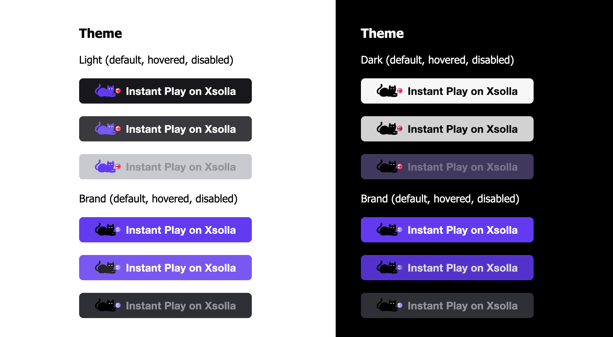
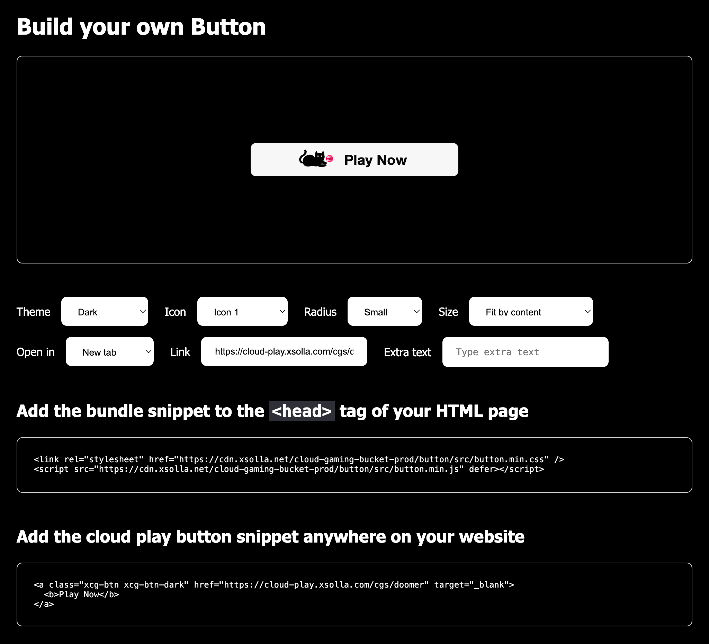

# Xsolla Cloud Play button

- [What is Cloud Play button?](#what-is-pay-station-sdk)
- [Quick Start](#quick-start)

## What is Cloud Play button?

Cloud play button is a fully customizable button that allows you to add an Xsolla Cloud Play button on your webpage.



## Quick Start

Add the bundle snippet to the `<head>` tag of your HTML page

```html
<link rel="stylesheet" href="https://cdn.xsolla.net/cloud-gaming-bucket-prod/button/src/button.min.css" />
<script src="https://cdn.xsolla.net/cloud-gaming-bucket-prod/button/src/button.min.js" defer></script>
```

Or copy over `src` folder into the root of your webpage folder and then add the bundle snippet to the `<head>` tag of your HTML page

```html
<link rel="stylesheet" href="src/button.min.css" />
<script src="src/button.min.js" defer></script>
```

And then you can add the cloud play button anywhere on your website with this snippet (example)

```html
<a class="xcg-btn" target="_blank" href="https://cloud-play.xsolla.com/cgs/doomer">
  <b>Play Now</b>
</a>
```

You could also use the "Build your own button" tool by running the `index.html` file in this folder too. After you finished your customized button selection, proceed to copy the generated snippet into your webpage.


